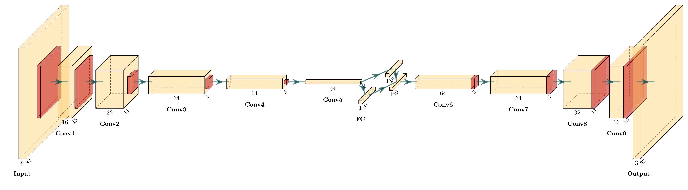
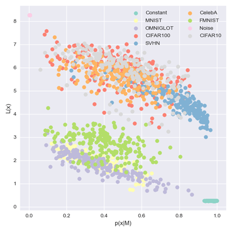

# Detecting Out-of-Distribution Inputs
## A reproducibility project based on the paper of Serra et al.: “Input complexity and out-of-distribution detection with likelihood-based generative models"

In this project, we are reproducing the work of [Serra et al.](https://arxiv.org/abs/1909.11480) (2019) to address the input complexity problem on OOD detection for likelihood-based generative models. We train Variational AutoEncoders (VAEs) on the FashionMNIST and CIFAR10 datasets, and then evaluate their performance on OOD detection on four popular datasets, namely MNIST, OMNIGLOT, CIFAR100, and CelebA, and two synthetic datasets of Random Gaussian Noise and Constant values. 

We adopted the usage of negative log-likelihoods and the proposed complexity estimate to produce the S score for OOD detection. Regarding the considered datasets we used FashionMNIST and CIFAR10 for training our generative models and MNIST, Omniglot, CIFAR100, CelebA, SVHN, Noise and Constant for testing for OOD. It should also be noted that we only used PNG as an image compressor. We opted for testing the original hypothesis both on FashionMNIST and CIFAR10, in an attempt to validate its credibility for different levels of complexity in the training data.

The main differentiation of our approach from the original lies in the fact that we leveraged VAEs as our generative model. Figure 1 displays the overall architecture of our network, which was used for training and producing our generative model. The graph was produced using [PlotNeuralnet](https://github.com/HarisIqbal88/PlotNeuralNet).

 <figure id="fig4" class="text-center">
            
            <figcaption class="figure-caption text-center">Figure 1: Visualization of the network's architecture.</figcaption>
        </figure>

\
For models trained on both FMNIST and CIFAR10 we used the same encoder and decoder architectures and used different latent space sizes to accommodate for the complexity discrepancies of used training datasets (10 for FMNIST and 75 for CIFAR100 respectively). The encoder was defined as a convolution network, inspired by the architecture used by Gulrajani et al. (2017), whereas the decoder simply transposed the architecture of the encoder. The encoder uses leaky ReLU activation functions with a slope of 0.2, whereas the decoder utilizes ReLUs. The architectures of the encoder and the decoder can be seen in more detail in Tables 1 and 2 respectively. Regarding the training, both models were trained for 200 epochs, with a fixed learning rate of 0.001 and a batch size of 128 images.

            

            <table id="tab2" class="table table-border text-center">
                <caption class="text-center">Table 1: Encoder Architecture</caption>
                <thead>
                <tr>
                    <th>Operation</th>
                    <th>Kernel</th>
                    <th>Strides</th>
                    <th>Feature Maps</th>
                </tr>
                </thead>
                <tbody>
                <tr>
                    <td>Input</td><td>5x5</td><td>2x2</td><td>8</td></tr>
                <tr>
                    <td>Conv1</td><td>5x5</td><td>1x1</td><td>16</td></tr>
                <tr>
                    <td>Conv2</td><td>5x5</td><td>2x2</td><td>32</td></tr>
                <tr>
                    <td>Conv3</td><td>5x5</td><td>1x1</td><td>64</td></tr>
                <tr>
                    <td>Conv4</td><td>5x5</td><td>2x2</td><td>64</td></tr>
                <tr>
                    <td>Conv5</td><td>--</td><td>--</td><td>2* latent_dim</td></tr>
                </tbody>
            </table>
            

            

            <table id="tab3" class="table table-border text-center">
                <caption class="text-center">Table 2: Decoder Architecture</caption>
                <thead>
                <tr>
                    <th>Operation</th>
                    <th>Kernel</th>
                    <th>Strides</th>
                    <th>Feature Maps</th>
                </tr>
                </thead>
                <tbody>
                <tr>
                    <td>Conv5</td><td>--</td><td>--</td><td>64</td></tr>
                <tr>
                    <td>Conv6</td><td>5x5</td><td>2x2</td><td>64</td></tr>
                <tr>
                    <td>Conv7</td><td>5x5</td><td>1x1</td><td>64</td></tr>
                <tr>
                    <td>Conv8</td><td>5x5</td><td>2x2</td><td>32</td></tr>
                <tr>
                    <td>Conv9</td><td>5x5</td><td>1x1</td><td>16</td></tr>
                <tr>
                    <td>Output</td><td>5x5</td><td>2x2</td><td>3</td></tr>
                </tbody>
            </table>
        

        

\
VAEs learn stochastic non-invertible transformations, which typically inhibits tractable estimation of the marginal likelihoods, as described in Nielsen et al. (2020). To compensate for this limitation, the authors propose SurVAE flows, a modular framework of composable transformations, that attempts to bridge the gap between normalizing flows and VAEs and produce a more efficient and robust generative model. SurVAE flows relies on surjective transformations, which are capable of computing the exact likelihood in one direction and a stochastic likelihood in the reverse direction respectively, thus providing a lower bound on the corresponding likelihood. In our experiments we leverage SurVAE flows and its stochastic transformations to build our VAE architecture. The encoder’s distribution is approximated by a multivariate Gaussian distribution with conditional mean and log standard deviation, while the decoder’s is approximated by a Gaussian distribution with conditional mean and learned standard deviation. 

## FMNIST Model Results

In this section we will present both qualitative and quantitative results germane to the performance of our VAE generative model, which was trained on the FMNIST dataset, and attempt to compare our findings with those of the original paper.

Figure 2 shows the relation between the likelihoods (normalized with respect to the largest value in the entirety of the considered test datasets) of our model trained on FMNIST and the complexity estimates for the corresponding inputs of the examined test sets. Upon observing the graph, contrary to the results of the original paper, there appears to be an unsignificant negative correlation between the log-likelihood and the complexity estimate, with a Pearson’s coefficient of -0.328. Nevertheless, we notice that a generative model trained on a simple dataset (such as FMNIST) is in fact capable of detecting OOD inputs with an optimal performance, by solely relying on the likelihoods. In particular, we notice that for more complicated test sets the model yields log-likelihoods close to zero, whereas images from the FMNIST test set yield the highest likelihoods. The examined model only assigns high likelihood (erroneous OOD prediction) for certain images from the Omniglot dataset. On the contrary, complexity on its own does not appear to be able to correctly detect OOD inputs for the entire complexity spectrum (reaching satisfactory performance for the most complicated datasets, but not being able to discriminate between FMNIST images and other images from simple datasets). Thus, the authors’ claims that complexity could theoretically substitute the log-likelihoods for the OOD task appears to not hold, at least for generative models trained on less complicated datasets.

  <figure id="fig5" class="text-center">
            
            <figcaption class="figure-caption text-center">Figure 2: Complexity estimates using a PNG compressor with respect to normalized likelihoods of a VAE model trained 
                on FMNIST (for visualization purposes, we here employ a sample of 200 images per data set).</figcaption>
        </figure>

\
In the next part of our analysis, we will study the impact of S score for the OOD detection task. For that, we first trained a generative VAE model on the train partition of FMNIST, as it was previously explained, and computed the S scores and negative log-likelihoods that this model yields for the test partitions of different datasets. Subsequently, the area under the Receiver Operating Characteristic Curve (AUROC) is calculated for both of these scores, which is a widely adopted evaluation measure for the OOD detection task (Hendrycks et al., 2018). We notice that both scores appear to be able to correctly detect OOD inputs ranging from highly complex images to simpler ones, which correspond to really good AUROC values (≈1). Nevertheless, it should be mentioned that the complexity estimate appears to have a minor impact in the calculation of S score, which can be attributed to the discrepancy of scales between the log-likelihood and the complexity estimate.

<table id="tab4" class="table table-border text-center w-75 mx-auto">
            <caption class="text-center">Table 3: AUROC values using negative log-likelihood and the proposed S score for the VAE model trained on FMNIST using the PNG compressor.</caption>
            <thead>
              <tr>
                <th rowspan="2">Datasets</th>
                <th colspan="2">AUROC</th>
                <th colspan="2">Average Scores</th>
              </tr>
              <tr>
                <th>S</th>
                <th>- log-likelihood</th>
                <th>S</th>
                <th>- log-likelihood</th>
              </tr>
            </thead>
            <tbody>
              <tr><td>Constant</td> <td>1.0</td><td>1.0</td><td>-2577.7</td><td>-2577.44</td></tr>
              <tr><td>MNIST</td><td>1.0</td><td>1.0</td><td>-3.346</td><td>-1.305</td></tr>
              <tr>
                <td>OMNIGLOT</td><td>0.989</td><td>1.0</td><td>-1.885</td><td>-0.105</td></tr>
              <tr>
                <td>CIFAR100</td><td>1.0</td><td>1.0</td><td>-2916.23</td><td>-2910.37</td></tr>
              <tr>
                <td>SVHN</td><td>1.0</td><td>1.0</td><td>-1959.44</td><td>-1954.95</td></tr>
              <tr>
                <td>CelebA</td><td>1.0</td><td>1.0</td><td>-2610.4</td><td>-2604.71</td></tr>
              <tr>
                <td>CIFAR10</td><td>1.0</td><td>1.0</td><td>-2736.35</td><td>-2730.44</td></tr>
              <tr>
                <td>Noise</td><td>1.0</td><td>1.0</td><td>-2633.54</td><td>-2625.28</td></tr>
              <tr>
                <td>FMNIST (test)</td><td>-</td><td>-</td><td>-0.976</td><td>1.744</td></tr>
            </tbody>
        </table>

## CIFAR10 Model Results

In this section we will perform a similar analysis for our VAE generative model, which was trained on the CIFAR10 dataset, and attempt to compare our findings with those from the original paper.

Figure 3 shows the relation between the normalized likelihoods of our model trained on CIFAR10 and the complexity estimates for the corresponding inputs of the examined test sets. In this case, we indeed notice a stronger, albeit not as significant as the one reported in the original paper, negative correlation between the log-likelihoods and the complexity estimates, with a Pearson’s coefficient of -0.542. Two distinct clusters can be detected, corresponding to simpler and more complicated datasets respectively. It should be noted that the negative correlation appears to be more prominent within each of these clusters. We can also note that images originating from a simpler dataset such as SVHN and a more complicated one like CelebA appear to correspond to similar complexity estimates (around 4-5 bits/dimension), which is an indication that the proposed complexity estimate might not reflect the actual complexity of the datasets. We should also point out that generative models trained on more complicated datasets (like CIFAR10) cannot rely solely on the log-likelihoods for successful OOD detection, and that a different OOD measure is indeed deemed necessary. 

 <figure id="fig6" class="text-center">
            
            <figcaption class="figure-caption text-center">Figure 3: Complexity estimates using a PNG compressor with respect to normalized likelihoods of a VAE model trained 
                on CIFAR10 (for visualization purposes, we here employ a sample of 200 images per data set).</figcaption>
        </figure>

\
We will perform a similar analysis regarding the impact of S score for the OOD detection task, for the generative VAE model trained on CIFAR10 and compare its performance with a simple negative log-likelihood score. In particular, Table 5 shows the resulting AUROC values for both the S score and negative log-likelihood score for all the considered test sets. We notice that for generative models trained on more complicated datasets (like CIFAR10) the l og-likelihoods fail to accurately detect all possibly OOD inputs. In particular, the unintuitive higher likelihoods for the SVHN datasets (as observed in Figure 3) correspond to a poor AUROC value of 0. Nevertheless, when looking at the AUROCs obtained with the S score, we notice an overall exacerbation in performance, especially for images from less complicated datasets such as MNIST, Omniglot and FMIST, which the model was capable of detecting as OOD using negative log-likelihood.

 <table id="tab5" class="table table-border text-center w-75 mx-auto">
            <caption class="text-center">Table 4: AUROC values using negative log-likelihood and the proposed S score for the VAE model trained on CIFAR10 using the PNG compressor.</caption>
            <thead>
              <tr>
                <th rowspan="2">Datasets</th>
                <th colspan="2">AUROC</th>
                <th colspan="2">Average Scores</th>
              </tr>
              <tr>
                <th>S</th>
                <th>- log-likelihood</th>
                <th>S</th>
                <th>- log-likelihood</th>
              </tr>
            </thead>
            <tbody>
              <tr><td>Constant</td> <td>0.0</td><td>0.0</td><td>1.656</td><td>1.91</td></tr>
              <tr><td>MNIST</td><td>0.0</td><td>1.0</td><td>-1.2</td><td>0.841</td></tr>
              <tr>
                <td>OMNIGLOT</td><td>0.0</td><td>0.988</td><td>-0.088</td><td>0.9</td></tr>
              <tr>
                <td>CIFAR100</td><td>0.495</td><td>0.846</td><td>-4.724</td><td>1.129</td></tr>
              <tr>
                <td>SVHN</td><td>0.0</td><td>0.0</td><td>-2.82</td><td>1.669</td></tr>
              <tr>
                <td>CelebA</td><td>0.086</td><td>0.926</td><td>-4.572</td><td>1.118</td></tr>
              <tr>
                <td>FMNIST</td><td>0.0</td><td>1.0</td><td>-1.804</td><td>0.916</td></tr>
              <tr>
                <td>Noise</td><td>1.0</td><td>1.0</td><td>-12.367</td><td>-4.107</td></tr>
              <tr>
                <td>CIFAR10 (test)</td><td>-</td><td>-</td><td>-4.73</td><td>1.186</td></tr>
            </tbody>
        </table>

